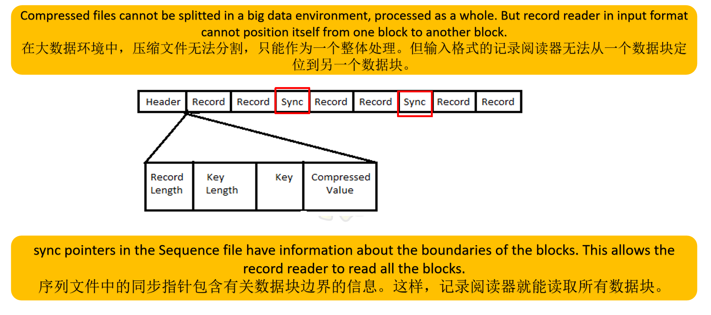

# Hadoop

## Test:

- Write completed code from ch4
- Write pieces of codes from ch5~7


- Explain three types of big data(structured, semi-structured, unstructured)
- Explain 4 'V'  （one line by one line, Volume, Velocity, Variety, Veracity)

- Explain three Hadoop modes


### ch1

- Hadoop Ecosystem(four layers and Hadoop Ecosystem tools)


### ch2

- Five daemons(HDFS and YARN)
- Pattern Configuration(core-site.xml, hdfs-site.xml, marpred-site.xml. yarn-site.xml)
- HDFS HA Architecture
  - active and standby NameNode
  - **Quorum Journal Nodes**(QJN) and **Shared Storage**


### ch3

- Block
- Replication Management

- HDFS
- YARN
- MapReduce


### ch4

- all commands(syntax and explain with examples)
  - count
  - du
  - dus
  - setRep
  - touchz
  - test
    - -e
    - -z
    - -d
  - expunge
  - other commands…

- HDFS Read Architecture


### ch5

- MapReduce
- Key process of MapReduce
- Input types
- Output types
- Job Scheduler


### ch6

- Serialization and Deserialization
- Why Hadoop Serialization is better than Java Serialization(The serialized value of Java serialization is bigger than Hadoop Serialization)
- Compression
  - gzip
  - LZO
  - Snappy
- Classes used
  - CompressionCodecFactory
  - Compression…
- **Java program to compress a file using Bzip2 format**

- Compression of Sequence File

  - NONE

  - RECORD

  - BLOCK

- The difference between SequenceFile and MapFile


### ch7

- Summarization patterns
- File Pattern
- Top N Design Pattern
- Distinct Pattern
- Data Organization Pattern


### ch8

- What is RPC
- Hadoop RPC Design Technique
- **Hadoop RPC Usage Method**


## **ch0 overview**

SQL

DDL - Data Definition Language - Create Alter Drop

DML - Data Manipulation Language - insert update delete

DCL - Data Control Language - grant revoke

DQL - Data Query Language - select


3 types of data

structured - data and tabular format

semi structured - xml, json

unstructured - some files(image, audios, videos, documents)


html - hypertext markup language

xml - extensible markup language

json - javaScript Object Notation


## Ch1 Big Data Concept

### What is Big Data

==**Big data** is a collection of data that is huge in volume, yet growing exponentially with time. Big data is also a data but with huge size.==


#### **==3 types of data==**

**Structured - data with tabular format**

> Any data that can be stored, accessed and processed in the form of fixed format is termed as a "structured data".

**Semi-structured - xml, json**

> Semi-structured data can contain both the forms of data. We can see semi-structured data as a structured in form but is actually not defined with a table definition in relational DBMS

**Unstructured - some files(images, audios, videos, documents)**

> Any data with unknown form or the structure is classified as unstructure data


#### **==characteristics of Big Data==**

- **Volume** - refers to the huge size of the data.                                       
- **Velocity** - refers to the fast speed of generation and procession of data.
- **Variety** - refers to heterogenous sources and the nature of data.
- **Veracity** - various levels of data uncertainty and reliability(the content quality ).
- (Value)


#### **Advantages of Big Data Processing**

- Businesses can utilize outside intelligence while taking decisions.
- Improved customer service.
- Early identification of risks to the product/services, if any.
- Better operational efficiency 操作效率.


**Key Vocabulary**

Exponential 指数型

Heterogeneous 异质 

Veracity 真实性


---

### **==Hadoop Ecosystem tools==**

==**Hadoop** only have **two components**:==

1. HDFS - to store data
2. YARN - to process data


#### **==Four layers of Hadoop ecosystem:==**

1. **Data Storage**
   - HDFS(File System) - ==Hadoop Distributed File System== 
   - HBASE(Column DB Storage) - columned database, NOSQL(Not Only SQL) database
2. **Data Processing**
   - Map Reduce(Cluster Management) - nothing, but java program
   - YARN(Cluster Management) - ==Yet another resource negotiator==
3. **Data Access**
   - Hive(SQL)
   - Pig(Dataflow)
   - Mahout(Machine Learning)
   - Avro(RPC) - ==RPC: Remote Procedure Call(you can understand 'procedure' as 'method', 'remote' means 'in other machines')==
   - Sqoop(RDBMS Connector) -> sql + oop
4. **Data Management**
   - Ooize(Workflow Monitoring)
   - Chukwa(Monitoring)
   - Flume(Monitoring)
   - ZooKeeper(Management)


#### **HBase**

- HBase is an **open-source**, non-relational distributed database. It is a **NoSQL database**.

- It supports all types of data.
- HBase was designed to **run on the top of HDFS**.

- The HBase is written in Java.


#### **==Hive==**

- ==Hive is used to **convert big data into stuctured data**==

- ==Hive defines a query language similiar to SQL, called **HQL**(Hive Query Language)==

- Hive provides a range of tools to **extract/transform/load** data(**ETL**)

- Hive can **store**, **query**, and **analyze** large-scale data stored in HDFS(or HBase)

**Details**

> - The Apache Hive data warehouse software 数据仓库软件 is built on Apache Hadoop to query and manage large distributed data sets.
> - It provides the following functions: 
>   - HIVE provides a range of tools to extract/transform/load data (ETL).
>   - HIVE can store, query, and analyse large-scale data stored in HDFS (or HBase).
>   - Hive defines a query language similar to SQL, called HQL.
>   - HQL is converted into MapReduce jobs and run on Hadoop to perform statistical analysis and processing of massive data.
>
>
> ==**Disadvantages** of Hive:==
>
> - Hive does not currently support transactions; 
> - Cannot modify table data (cannot update, delete, insert; You can only append and reimport data through files) 
> - Slow query speed 


#### **HDFS**

HDFS is a specially designed file system for storing huge datasets in commodity hardware, storing information in different formats on various machines.


#### **==Apache storm==**

- ==Apache Storm is a free, open source distributed **real-time computing** system that simplifies the reliable processing of **streaming data**.==

**three advantages**==

- ==**easy to expand**== 易扩展 - horizontal scaling

- ==**fault tolerance**== 容错 - if one machine has problem, you can still do work in other machines

- **==low latency==** 低延迟 - means fast

> horizontal scaling - add machines
>
> vertical scaling - add resources


#### ==**ZooKeeper**==

- ==Apache Zookeeper is the **coordinator** 协调者 of any Hadoop job which includes a combination of various **services** in a Hadoop Ecosystem.==
- Apache Zookeeper coordinates with 使协调，配合 various services in a distributed environme


#### ==**Sqoop**==

- ==allow user to **extract data from relational databases into Hadoop** for further processing.==

- The import process runs a MapReduce job that connects to the MySQL database and reads data from the tables.


---


### **Hadoop History and Version**

The Hadoop was started by Doug Cutting and Mike Cafarella in 2002. Its origin was the Google File System paper, published by Google。


[关于Hadoop1.x vs 2.x vs 3x.md 请点此跳转](.\Hadoop 1.x vs 2.x vs 3.x.md)

[关于Hadoop1.x vs 2.x vs 3x.pdf 请点此跳转](.\Hadoop 1.x vs 2.x vs 3.x.pdf)

---


### **Hadoop Distributions**

**some examples:**

Cloudera Hadoop Distribution

Hortonworks Hadoop Distribution

MapR Hadoop Distribution

Pivaotal HD


#### **==Criteria to evaluate distribution==**

- **Performance**
- **Scalbility** 可扩展性
- **Reliability**


> 生词：
>
> Replication 复制
>
> Bottlenecks 瓶颈


---

## Ch2 Hadoop and Big Data Architecture

#### ==Overviwe of Hadoop operating modes==

- ==**Hadoop Local operation/Runtime mode**==

  > Hadoop **run** in a non-distributed mode as **a single java process.**
  > **no daemons**
  > for **developing phase**

- ==**Hadoop Pseudo-Distributed mode**==

  > Hadoop **run on a single node**, with **each Hadoop daemon running in a separate java process.**
  > **five daemons**
  > for **experimental learning**
  > just one machine is required

- ==**Hadoop Fully Distributed mode**==

  > Hadoop **runs on a cluster** where **each Hadoop daemon runs in java processes on each server node in the cluster.**
  > **five daemons** 
  > at least five machines(each daemons should have a computer)
  > for **experimental verification and enterprise**

  

**Hadoop HA Running mode**(not a distributed mode, only a running mode) - ==active NameNode, standby NameNode,  master slave topology==

**difference between standby NameNode and Secondary NameNode**

> - The standby NameNode serves the purpose of a backup NameNode (unlike the Secondary NameNode) which **incorporate failover capabilities to the Hadoop cluster**.
>
> - **standby namennode** is **a backup of NameNode**, when the active NameNode has problem, **it can become active NameNode.**
>
> - **Secondary NameNode** is **a backup of data of NameNode**, when the NameNode has some data loss, Secondary NameNode can **send the backup of loss data**, but **it cannot become the NameNode.**


==**five daemons**==

> NameNode
>
> Secondary NameNode
>
> DataNode
>
> ResouceManager
>
> NodeManager


---

#### Hadoop Local Operating/Runtime Mode

- Run in a **non-distributed** mode as a single Java process, which is called Local (Standalone) mode.
- **No daemons** to run in this mode, and all programs are executed on a single JVM.
- Suitable for use during the **development phase**.


---

#### **Hadoop Pseudo-Distributed mode**

- Hadoop can run on **a single node**, with each Hadoop daemon running in a separate Java process.
- The Hadoop pseudo-distributed cluster also has **five processes** after the Hadoop full-distributed cluster is started.
- Often used in the **experimental learning phase**.


`jps` - java process state

`start-all.sh` to start hadoop


**HDFS daemons process**

Used to solve the problem of **storing** large amounts of data.

> NameNode
>
> Secondary NameNode
>
> DataNode

only want to storage data/use HDFS

> **`start-dfs.sh`**
>
> **`stop-dfs.sh`**


**YARN daemons process**

YARN is the **resource management** system.

> ResourceManager
>
> NodeManager

only want to use yarn

> **`start-yarn.sh`**
>
> **`stop-yarn.sh`**


---

#### **Hadoop Fully Distributed Mode**

- Runs in Java processes on **each server node** in the cluster
- Often used in the stage of **experimental verification** and **enterprise commissioning**.
- The total number of processes in the cluster is the same as that in pseudo-distributed mode.


---

#### **==Hadoop HA Running Mode==**

HA - High Availability 高可用性，namely fault-tolerance

> if a machine in a cluster has a problem, other machines can still process without disturbance.


- Introduced in Hadoop 2.x to solve the single point of failure problem in Hadoop 1.x
- Follows Master/Slave Topology 主从拓扑
- Introduction of Secondary NameNode did prevents from data loss and offloading some of the burden of the NameNode.


**HDFS HA Architecture**

- The concept of High Availability cluster **was introduced in Hadoop 2.x** to **solve the Single Point of Failure(SPOF) problem in Hadoop 1.x.**

- The HA architecture solved this problem of NameNode availability by allowing us to **have two NameNodes in an active/passive configuration**. So, we have two running NameNodes at the same time in a High Availability cluster: 
  - **Active NameNode** 
  - **Standby/Passive NameNode** 

- If one NameNode goes down, the other NameNode can take over the responsibility and therefore, reduce the cluster down time. 
- The standby NameNode serves the purpose of a backup NameNode (unlike the Secondary NameNode) which incorporate failover capabilities to the Hadoop cluster.


Hadoop1.x

> Single Point of Failure, SPOF 单点故障


**Two rules/conditions/issues in maintaining consistency in the HDFS High Availability cluster**

1. ==**Only one** NameNode can be **active NameNode**.==

2. ==Active NameNode and standby NameNode must be in **synchronization**.==


==How to sync active NameNode/ standby NameNode==

> 1. ==Quorum journal node==
> 2. ==Shared storage==
>
> Active NameNode will create Editlog and standby NameNode will read the editlogs and copy it in iteself.


**Implementation of HA Architecture**

- ==using **Quorum Journal Nodes**(QJN)==

  - Standby(备用状态) NameNode and the active(活跃状态) NameNode keep in sync 同步 with each other through a separate group of nodes or daemons -called JournalNodes.

    > These nodes serve the request coming to them and copy the information into other nodes in the network. This provides fault tolerance in case of JournalNode failure.

  - ==Active NameNode is responsible for updating the EditLogs present in the JournalNodes.==

  - StandbyNode reads the changes made to the EditLogs in the JournalNode and applies it to its own namespace in a constant manner.

  - During failover 故障切换 , the StandbyNode makes sure that it has updated its metadata information from the JournalNodes before becoming the new Active NameNode. 

  - IP Addresses of both the NameNodes are available to all the DataNodes and they send their heartbeats and block location information to both the NameNode.


- ==Using **Shared Storage**==

  - Standby NameNode and the active NameNode keep in sync with each other by using a shared storage device. 

  - The active NameNode logs the record of any modification done in its namespace to an EditLog present in this shared storage. 

  - The StandbyNode reads the changes made to the EditLogs in this shared storage and applies it to its own namespace.

  - During failover - StandbyNode updates its metadata information using the EditLogs in the shared storage.

  - Administrator must configure at least one fencing method to avoid a split-brain scenario.
  
    - Share Fencing: to ensure that only one NN can be written to edits.
    - Data node Fencing: ensures the only one NN can respond to client requests.
    - Client Fencing: ensures that only one NN can send commands to the DN such as deleting and replicating blocks.
  


[关于HA Quorum Jornal Manager and shared storage.md 请点此跳转](.\HA Quorum Jornal Manager and shared storage.md)

[关于HA Quorum Jornal Manager and shared storage.pdf 请点此跳转](.\HA Quorum Jornal Manager and shared storage.pdf)

---

#### ==Pattern Configuration==

**Installing hadoop**

step1 - install jdk
step2. install hadoop
step3. configuration setting


##### HDFS Configuration

**==core-site.xml==:** In pseudo-distributed mode, you only need to configure the NameNode RPC remote communication address and port number. The property name is `fs.defaultFS` and the default port number is 8020.


**==hdfs-site.xml==:** ==In pseudo-distributed mode, you only need to set the number of data block copies to 1==. The property name is `dfs.replication`.


##### YARN Configuration

**==mapred-site.xml==:** In pseudo-distributed mode, you only need to set the MapReduce operating framework to YARN. The property name is `mapreduce.framework.name`.


**==yarn-site.xml==:** In pseudo-distributed mode, only the ResourceManager communication address and aux-services of the NodeManager need to be configured. The name of properties are: `yarn.resourcemanager.hostname` and `yarn.nodemanager.aux-services`.


##### Other configuration

**==hadoop-env.sh==:** In order to develop Hadoop programs in java, you have to set the java environment variables in `hadoop-env.sh` file by replacing `JAVA_HOME` value with location of java in your system.


---

#### **Hadoop Authority Management**

Hadoop access control is divided into two levels (system level and scheduler).

ServiceLevel Authorization is the system level, which is used to control whether specified services can be accessed. For example, whether users/groups can submit jobs to the cluster.

**core-site.xml**

```xml
<property> 
	<name>hadoop.security.authorization</name> 
	<value>true</value> 
</property>
```

`hadoop.security.authorization=true`. Turns on ServiceLevel Authorization

`hadoop.security.authorization=false` does not pass any verification. All users have full permissions.

- Service LevelAuthorization has 9 configurable properties (in **hadoop**-**policy**.**xml file)**, each of which specifies the user or user group that has the appropriate access rights.


**HDFS Configuration**

path: `cd /training/hadoop-3.3.6/etc/hadoop`

important configuration files:(book 2.4-2.6)

> hadoop-env.sh
> hdfs-site.xml
> core-site.xml
> mapred-site.xml (mapred - mapreduce - java programs)
> yarn-site.xml


acl - access control level


---

#### Add DataNode

Hadoop has a scale-out architecture 扩展结构. 

cluster has insufficient capacity - add a DataNode.

1. **Increase hostname**
   Enter the hosts file and add the host name and IP address of the newly added file
   `192.1681.20 slave20` (for example)
2. **Copy the hadoop installation file**
   Enter the DataNode node and execute
   `scp -R hadoop  hadoop@slave20:/niit/`
3. **Start new node**
   Go to the sbin directory of hadoop and execute
   `hadoop-daemon.sh start DataNode`


---

#### Reduce DataNode

It is **not recommended** to use the `hadoop-daemon.sh stop` command to stop DataNode command to turn off the DataNode, which will result in a **missing block** in hdfs. Correctly reduce the DataNode should **create an exclude 排除 file**, add the node host name to be deleted in the exclude file.

1. **Edit the core-site.xml file**
   Add the configuration item dfs.hosts.exclude to the file as follows:

   ```xml
   <property>
    <name>dfs.hosts.exclude</name>
    <value>/opt/niit/hadoop/conf/exclude</value>
    <description>Names a file that contains a list of hosts that are
    not permitted to connect to the NameNode. The full pathname of the
    file must be specified. If the value is empty, no hosts are
    excluded.</description>
   </property>
   ```

2. **Edit the hdfs-site.xm file**
   Add the configuration item dfs.hosts.exclude to the file as follows:

   ```xml
   <property>
    <name>dfs.hosts.exclude</name>
    <value>/opt/niit/hadoop/conf/exclude</value>
    <description>Names a file that contains a list of hosts that are
    not permitted to connect to the NameNode. The full pathname of the
    file must be specified. If the value is empty, no hosts are
    excluded.</description>
   </property>
   ```

3. **Edit the exclude file**
   `vi /opt/niit/hadoop/conf/exclude`
   Add nodes to the file that need to be deleted, one line at a time.

4. **Dynamic refresh node**
   `bin/refresh-NameNodes.sh`


---

#### Load Balancing

Generally, data is loaded when it is entered into the cluster, and distributed and stored according to the situation of each node. But after adding new nodes, if you want to achieve load balancing, you need to use the balance command.

`bin/start-balancer.sh -threshold 10`

When moving, Hadoop will consider the following factors(all are rules should be followed):

- The block that needs to be moved has not been moved during the current balance process.

  > It means the block you are trying to be moved, make sure its not moved before in the same blance process. Or you can say block should not be moved twice in other word

- The block that needs to be moved does not exist on the targer machine - this is to be verified.

- Blocks that need to be moved, do not change the number of blocks on each rack after moving.


---


words

> Standalone 单机 - just only one machine
> Decompress 解压缩
> Daemon 守护进程
> Cluster 簇
> Deployment 部署
> Topology 拓扑结构
> Offloading 卸载
> Metadata 元数据 - data about data
> Authorization 授权


---

### Hadoop and Big Data Architecture

#### ==Hadoop Ecosystem==

It is a platform or framework which solves big data problems

==A suite which encompasses a number of services (ingesting, storing, analyzing and maintaining)==

==**Four services of Hadoop ecosystem**==

1. **Ingesting** - collect data from different sources

2. **Storing**

3. **Analyzing**

4. **Maintaining**


---

#### Big Data Technology Architecture

The V’s of Big Data are volume, variety, velocity and veracity and each impacts data collection, monitoring, storage, analysis and reporting


**Orchestration**

> **What is orchestration**
> *Workflow orchestration*, sometimes referred to as *workflow automation* or *business process automation*, refers to **the tasks of scheduling, coordinating, and managing workflows**. *Workflows* are sequences of data processing actions. A system capable of performing orchestration is called an *orchestration framework* or *workflow automation framework*.
>
> Workflow orchestration is an important but often neglected part of application architectures. It is especially important in Hadoop because many applications are developed as MapReduce jobs, in which you are very limited in what you can do within a single job. However, even as the Hadoop toolset evolves and more flexible processing frameworks like Spark gain prominence, there are benefits to breaking down complex processing workflows into reusable components and using an external engine to handle the details involved in stitching them together.
>
> **Why We Need Workflow Orchestration**
>
> Developing end-to-end applications with Hadoop usually involves several steps to process the data. You may want to use Sqoop to retrieve data from a relational database and import it to Hadoop, then run a MapReduce job to validate some data constraints and convert the data into a more suitable format. Then, you may execute a few Hive jobs to aggregate and analyze the data, or if the analysis is particularly involved, there may be additional MapReduce steps.
>
> Each of these jobs can be referred to as an *action*. These actions have to be scheduled, ...


---

### **Hadoop Real-time Computing Architecture**

The real-time computing power of Hadoop come from component Apache Storm. 

Storm has many use cases, such as real-time analysis, online machine learning, continuous computing, distributed RPC, ETL, etc

> RPC - Remote Procedure Call
> ETL - Extract Transform Load
> ERP - Enterprise Resource Planning
> CRM - Customer relationship management
> OLAP - Online Analytical Processing
> BI - Business Intelligence
> Power BI / Tableau


Data source

Data acquisition

Data storage

Data analysis

Reporting and visualization


Storage Layer: keep data in the right place - Hadoop

Visualization support: the success of the project -Tableau.

Predictive analysis support - Apache Spark MLlib

The flexible backend to store result data - NoSQL

Processing Layer: do magic with data - Apache Sqoop

Security Layer: providing security

Monitoring Layer: auditing, testing, managing


---

## Ch3. Hadoop Composition and Structure

Hadoop is a distributed System infrastructure developed by the Apache Foundation and designed by Doug Cutting, inspired by Map/Reduce and Google File System(GFS) developed by Google Lab.

### Hadoop Architecture and Components

Hadoop has a master-slave topology

> Master node's function is to assign a task to various slave nodes and manage resources.
> The slave nodes do the actual computing.

HDFS - Primary storage unit in the Hadoop Ecosystem

YARN - Update to Hadoop, responsible for Resource management and Job Scheduling


Master - NameNode, (SecondaryNameNode), ResourceManager

Slave - DataNode, NodeManager


> ROM - Read Only Management
> RAM - Random Access Memory


**NameNode** - contains metadata in RAM and disk (**EditLog** and **FSImage** *(File system image)*)

> ==Responsible for **monitoring the Health Status of the Slave Nodes** and **assigning Tasks to the Data Nodes**.==
>
> > - Editlogs- It keeps track of each and every changes to HDFS.
> > - Fsimage- It **stores the snapshot** of the **file system.**

**SecondaryNameNode** - contains a copy of NameNode's metadata on disk

> The Secondary NameNode is not a backup of NameNode, ==it **acts as a Buffer to the NameNode**====. It stores the intermediate updates of the FSImage of the NameNode in the EditLog and updates the information to the Final FSImage when the NameNode is inactive.==
>
> > - I==t gets the edit logs from the NameNode **in regular intervals** and applies to fsimage==
> > - ==Once it has new fsimage, it copies back to NameNode==
> > - ==NameNode will use this fsimage for the next restart,which will reduce the startup time==

**DataNode** - contains the actual data in the form of blocks

> ==DataNode is the actual unit which **stores the data**. It is known as the Slave and it **responds to the NameNode about its Health Status** and the **take status in the form of a Heartbeat**.==


#### ==**3 layers of Hadoop Architecture**==

1. **Storage Layer**

2. **Resource Management Layer**

3. **Application Layer**


#### Hadoop Core Components

- Hadoop HDFS to store data across slave machines.
- Hadoop YARN for ==**resource management**== and **==job scheduling==** in the Hadoop cluster.


### Hadoop HDFS Architecture

#### Block in HDFS

==Block is the smallest unit of storage on a computer system. It is the smallest contiguous storage allocated to a file, we have a default block size of 128 MB.==


#### Replication Management

replication: copy of blocks


- HDFS uses a replica process to handle faults.

- ==Replication factor decides how many copies of the blocks get stored. It is 3 by default but we can configure to any value.==

**rules:**

1. ==A DataNode can have only one copy of a single block.==
2. ==A rack can have maximum 2 copies of a data block==


**3 ways to upload data**

1. GUI
2. command
3. java


#### **==Advantages and Disadvantage of HDFS Architecture==**

**Advantages**

- ==Data is **highly fault-tolerant**==
- ==Suitable for **processing Big Data**==
- ==**Supports streamed data retrieval**, ensuring data consistency==
- ==**Cost effective**, can be **built on low-cost machines** to improve reliability using a multicast mechanism==

**Disadvantages**

- ==**Not good for low-latency data access**(because of network time consuming - distributed)==

- ==**Fail** to efficiently store a large number of **small files**(because of blocks)==

- ==**Do not support concurrent writing and random file modification**==

  > Write and modify file in Hadoop is possible but not recommended, because the file is diveded into different blocks and you don't know which block should be modified and you can only add data to the unfilled blocks.

  


### Hadoop's YARN Architecture

- Hadoop YARN (Yet Another Resource Negotiator) is the cluster resource management layer of Hadoop and is responsible for **==resource allocation==** and **==job scheduling==.**

- It is introduced in the Hadoop 2.0 version. 
- YARN is the middle layer between HDFS and MapReduce in the Hadoop architecture.

#### Why YARN?

==**MapReduce performed both processing and resource management functions in Hadoop version 1.0 and has only HDFS, MapReduce & common modules** while Hadoop version 2.0 also has YARN module.==

Job Tracker allocated resources, performed scheduling and monitored the processing jobs.

- This design resulted in **scalability botteneck** due to **a single Job Tracker**.

- It's limited only to MapReduce processing paradigm.


#### YARN Core Components

==The elements of YARN include:==

==■ ResourceManager (one per cluster)==

==■ ApplicationMaster (**one per application**)==

==■ NodeManagers (one per node)==

==■ Container==


The basic principle behind YARN is to separate resource management and job scheduling/monitoring function into separate daemons. 

- ==**NodeManager (NM):** NM monitor the resource usage by the container and sends signals (heartbeats) to ResourceManger.== The resources are like CPU, memory, disk, network and so on.

- ==**ApplicationMaster (AM):** AM manages the resource needs of individual applications and interacts with the scheduler to acquire the required resources.== It connects with the node manager to execute and monitor tasks.

- ==**Container:** Houses a collection of resources like RAM, CPU, and network bandwidth. Allocations are based on what YARN has calculated for the resources.== The container provides the rights to an application to use specific resource amounts.

- **Resource Manager (RM):** ==RM manages the resource allocation in the cluster and is responsible for tracking how many resources are available in the cluster and each node manager’s contribution.== It has two main components:
  - **Scheduler:** <u>Scheduler is responsible for allocating resources to various running applications and scheduling resources based on the requirements of the application.</u> This is a pure scheduler as it does not perform monitor track the status of the application. It also does not reschedule the tasks which fail due to software or hardware errors. 

  - **Application Manager:** <u>Accept job submissions from the client or monitor and restart application masters in case of failure.</u>


#### Application Workflow in Hadoop YARN


### Hadoop MapReduce Architecture

==MapReduce is a programming framework that allows us to perform distributed and parallel processing on large data sets in a distributed environment.==

MapReduce consists of two distinct tasks – Map and Reduce.

MapReduce is a java application.

> Mapper Class and Reducer Class


**Traditional Way for parallel and distributed processing**

Critical path problem
Reliability problem
Equal split issue
Single split may fail
Aggregation of result


**Map Reduce Components**

- Mapper
- Combiner
- Shuffle and Sort
- Reducer


==**Mapper:** Mapper function accepts key-value pairs as input as (k, v), where **the key represents the offset 偏移(position)  address of each record** and **the value represents the entire record content.** The output of the Mapper phase will also be in the key-value format as (k’, v’).==


==**Shuffle and Sort:** The output of various mappers (k’, v’), then goes into Shuffle and Sort phase. **All the duplicate values are removed, and different values are grouped together based on similar keys.** The output of the Shuffle and Sort phase will be key-value pairs again as key and array of values (k, v[]).==


==**Reducer:** The reducer receives the key-value pair from multiple map jobs. Then, the reducer **aggregates those intermediate data tuples (intermediate key-value pairs) into a  key-value pairs which is the final output.**==


`yarn node -list`

`yarn application -list`

`yarn version`

`yarn envvars`

`yarn -help`


## Ch4 HDFS Distributed File System

### Hadoop Shell Commands

`put` , `copyFromLocal` , `get` , `copyToLocal`

> used to transfer a file from local(Linux) to HDFS
>
> used to transfer a file From HDFS to local(Linux)

`touch` used to create an empty file

`hdfs dfs -touchz <file_path>`


`hdfs dfs`

`test`

> `-e` , test whether this file is existed
> `-z` , test thether this file size is zero, namely empty
> `-d`
>
> > it will not give any output, but you can use`echo $?` after each `test` command

`expunge`

`chown`

`chmod`

> e

`chgrp`


##### ls command

`hdfs dfs -ls <path>`


##### mkdir command

`hdfs dfs -mkdir <folder_path>`


##### ==touchz== command - It creates an empty file(If the file already exists, the access and modification times of the file will not be updated)

`hdfs dfs -touchz <file_path>`


##### ==touch== command - It is used to create a file without any content(If the file already exists, the access time and modification time of the file will be updated)

`hdfs dfs -touch <file_path>`


##### ==count== command - is used to count a number of directory, a number of files, and file size on HDFS

`hdfs dfs -count <file_path>`


##### ==du== and ==dus== command - It is used to estimate the space used by files and directories

`hdfs dfs -du <dirName>` - size of each file in the directory

`hdfs dfs -dus <dirName>` - total size of the direcory/file

> du - disk usage


##### ==copyFromLocal== (or) ==put== - copy files/folders from local file system to hdfs store

`hdfs dfs -copyFromLocal <local_file_path> <dest(present on hdfs)>`

`hdfs dfs -put <local_file_path> <dest(present on hdfs)>`


##### ==copyToLocal== (or) ==get== - copy files/folders from hdfs store to local file system

`hdfs dfs -copyToLocal <srcfile(on hdfs)> <local file dest>`

`hdfs dfs -get <srcfile(on hdfs)> <local file dest>`


##### ==moveFromLocal== - move files from local to hdfs

`hdfs dfs -moveFromLocal <local src> <dest(on hdfs)> `


##### cp - is used to copy files within hdfs

`hdfs dfs -cp <src(on hdfs)> <dest(on hdfs)>`


##### mv - move files within hdfs

`hdfs dfs -mv <src(on hdfs)> <src(on hdfs)> `


##### cat - To print file contents.(Read)

`hdfs dfs -cat <path>`


##### tail - Output the contents of 1K bytes at the end of the file to stdout

`hdfs dfs -tail [-f] <path>`


##### ==test Options:==

- ==`-e` checks if the file exists. Returns 0 if it exists.==
- ==`-z` checks if the file is 0 bytes. If so, return 0.==
- ==`-d` if the path is a directory, return 1, otherwise return 0.==

`hdfs dfs -test -[ezd] <path>`


##### text - Output the source file into text format

`hdfs dfs -test <path>`


##### rmr - deletes a file from HDFS recursively

`hdfs dfs -rmr <filename/directoryName>`


##### rm - deletes a file from HDFS

`hdfs dfs -rm <file_name>`


##### rmdir - remove direcories only if they are empty

`hdfs dfs -rmdir <direcotyName>`


##### ==expunge== - clean up the recycle bin

`hdfs dfs -expunge`


##### ==stat== - it will give the last modified time of the directory or file

`hdfs dfs -stat <path>`


##### ==setrep== - change the replication factor of a file/directory in HDFS

`hdfs dfs -setrep [-R] [-w] <replication-factor> <path>`

> `<replication-factor>` 指定新的副本数，必须是一个正整数
> `<path>` 指定要修改副本数的文件或目录路径
> `-R`递归选项。如果指定路径是一个目录，则会递归地更改该目录下所有文件的副本数
> `-w`等待选项。在修改副本数后，命令会等待直到所有副本都成功创建或删除


##### ==hdfs dfs== - check out the list of dfs commands using the following command

`hdfs dfs`


##### ==chown== - change the owner of the file.

`hdfs dfs -chown [-R] [OWNER][:[GROUP]] <path>`

> `-R` Recursively change the ownership of all files and directories within the specified directory.
> `OWNER` The new owner of the file or directory.
> `GROUP` The new group of the file or directory. If you want to change only the group, you can use `:GROUP` without specifying the owner.
> `PATH` The path to the file or directory whose ownership you want to change.


##### ==chmod== - change the permissions of files

`hdfs dfs -chmod [-R] MODE <path>`

> `MODE` Specifies the new permissions for the file or directory. This can be specified in either symbolic mode or numeric (octal) mode.
> `-R` Recursively change the permissions of all files and directories within the specified directory.


##### chgrp - changes the group to which the file belongs.

`hdfs dfs -chgrp [-R] [OWNER][:[GROUP]] <path>`


##### fsck - check the health of the entire file system

`hdfs dfs -fsck [options] <path>`


### HDFS Read and Write Architecture

#### HDFS Read Architecture

- The client will reach out to NameNode asking for the block metadata for the file. 
- The NameNode will return the list of DataNodes where each block (Block A and B) is stored. 
- After that client, will connect to the DataNodes where the blocks are stored. 
- The client starts reading data parallel from the DataNodes (Block A from DataNode 1 and Block B from DataNode 3). 
- Once the client gets all the required file blocks, it will combine these blocks to form a file. 


#### HDFS Write Architecture

- To write data in HDFS, the client first interacts with the NameNode to get permission to write data and to get IPs of DataNodes where the client writes the data.
- The client then directly interacts with the DataNodes for writing data. The DataNode then creates a replica of the data block to other DataNodes in the pipeline based on the replication factor.

- If the replication factor is 3, then there will be a minimum of 3 copies of blocks created in different DataNodes.


### JAVA Application Interface HDFS Operations

#### Java API methods for HDFS operation

==**copyFromLocalFile:** To upload a file from local machine to HDFS==

`public void copyFromLocalFile(Path src, Path dst)`

==**copyToLocalFile:** To download a file from HDFS to local machine==

`public void copyToLocalFile(boolean delSrc, Path src, Path dst) throws IOException`

```java
public void copyToLocalFile(
    boolean delSrc,     // 是否删除源文件
    Path src,           // HDFS 源文件路径
    Path dst,           // 本地目标路径
    boolean useRaw      // 是否使用原始本地文件系统（绕过校验和）
) throws IOException
```

==**delete:** Delete a file at the specified location==

`public abstract boolean delete(Path f, boolean recursive) throws IOException`

> **`recursive`**: A boolean flag indicating whether to delete the directory recursively.
> If `true`, the method will delete the directory and all its contents (files and subdirectories).
> If `false`, the method will delete only the specified file or empty directory.
>
> Return Values:
>
> - The method returns `true` if the deletion is successful.
> - It returns `false` if the deletion fails (e.g., if the file or directory does not exist).

==**rename:** Rename a file at the specified location==

`public abstract boolean rename(Path src, Path dst) throws IOException` 

==**mkdirs:** Create a directory at the specified location==

`public boolean mkdirs(Path f) throws IOException`

> - The method returns `true` if the rename operation is successful.
> - It returns `false` if the rename operation fails (e.g., if the source file does not exist, or if the destination path is invalid).

==**listStatus:** Display all directories and files in the current directory according to the given directory==

`public abstract FileStatus[] listStatus(Path f) throws FileNotFoundException, IOException`

==**open:** To open the file of HDFS FileSystem==

`public FSDataInputStream open(Path f) throws IOException`

> This method **is part of the `FileSystem` class** in the Hadoop API and returns an `InputStream` that can be used to read the contents of the file.
>
> `f`: A Path object representing the file in HDFS that you want to open.
>
> The method returns an `FSDataInputStream` object, which is a subclass of `InputStream` and provides additional functionality for reading data from HDFS.

==**copyBytes:** To copy data from input stream to output stream==

`public static void copyBytes(InputStream in, OutputStream out, int buffersize, boolean close)`

> `in`: The InputStream from which data is read.
> `out`: The OutputStream to which data is written.
> `buffersize`: The size of the buffer used for copying data. This should be a positive integer. A larger buffer size can improve performance by reducing the number of read/write operations.
> `close`: A boolean flag indicating whether the streams should be closed after the copying process is complete. **If set to true, both the input and output streams will be closed. If set to false, the streams will remain open after copying, until manually close.**


#### Client File Writing Operation

```java
public class FileWrite {
    public static void main(String[] args) throws URISyntaxException, IOException {
        // Create a new Configuration object to load Hadoop configuration settings
        Configuration conf = new Configuration();
        // Get an instance of the FileSystem object, specifying the HDFS URI and configuration
        // The URI "hdfs://niit01:8020" points to the HDFS cluster with the name node running on 'niit01' at port 8020
        FileSystem fs = FileSystem.get(new URI("hdfs://niit01:8020"), conf);

        // Open an InputStream to read from the local file
        // The file path is "D:/Study/NIIT/Big Data Development(Hadoop)/Notes Ch-1.docx"
        InputStream inputStream = new BufferedInputStream(new FileInputStream("D:/Study/NIIT/Big Data Development(Hadoop)/Notes Ch-1.docx"));

        // Create an OutputStream to write to a file in HDFS
        OutputStream outputStream = fs.create(new Path("/bdb2/CourseStatus.txt"));

         // Use IOUtils.copyBytes to copy data from the InputStream to the OutputStream
        // The buffer size is set to 4096 bytes, and the 'false' parameter indicates that the streams should not be closed automatically
        IOUtils.copyBytes(inputStream, outputStream, 4096, false);
        
        // Manually close the InputStream and OutputStream to release resources
        IOUtils.closeStream(inputStream);
        IOUtils.closeStream(outputStream);
    }
}
```


#### Client File Read Operation

```java
public class FileRead {
    public static void main(String[] args) throws URISyntaxException, IOException {
        Configuration conf = new Configuration();
        FileSystem fs = FileSystem.get(new URI("hdfs://niit01:8020"), conf);

        Path path = new Path("/bdb2/data.txt");

        InputStream inputStream = null;
        inputStream = fs.open(path);

        IOUtils.copyBytes(inputStream, System.out, 4096, false);

        IOUtils.closeStream(inputStream);
    }
}
```


#### ==Upload Files locally to HDFS==

```java
public class CopyToHdfs {
    public static void main(String[] args) throws Exception {
        Configuration conf = new Configuration(); 
        FileSystem fs=FileSystem.get(new URI("hdfs://niit01:8020"),conf);
        Path source=new Path("C://data.txt"); //windows file path
        Path dest=new Path("/niit/"); //hdfs directory path
        fs.copyFromLocalFile(source,dest); // Use the FileSystem object to copy the file from the local file system to HDFS
        System.out.println("File copied to hdfs");
    }
}	
```


#### Download a file from HDFS

```java
public class CopyToLocal {
    public static void main(String[] args) throws URISyntaxException, IOException {
        Configuration conf=new Configuration();
        FileSystem hdfs=FileSystem.get(new URI("hdfs://niit01:8020"),conf);
        Path dest=new Path("D://");                //windows file path
        Path source=new Path("/niit/abc.txt");      //hdfs directory path
        hdfs.copyToLocalFile(false,source,dest,true);
        System.out.println("File copied to Local");
    }
}
```

```java
public void copyToLocalFile(
    boolean delSrc,     // 是否删除源文件
    Path src,           // HDFS 源文件路径
    Path dst,           // 本地目标路径
    boolean useRaw      // 是否使用原始本地文件系统（绕过校验和）
) throws IOException
```


#### ==Rename File==

```java
public class RenameFile {
    public static void main(String[] args) throws Exception {
        Configuration conf=new Configuration();
        FileSystem fs=FileSystem.get(new URI("hdfs://niit01:8020"),conf);

        Path path=new Path("/niit/data.txt");
        Path path1=new Path("/niit/data_new.txt");
        // Rename the file using the FileSystem.rename method
        // This method returns true if the rename operation is successful, otherwise false
        boolean isRenamed=fs.rename(path,path1);

        if (isRenamed) {
            System.out.println("File is renamed");
        } else {
            System.out.println("File is not renamed");
        }
        
    }
}
```


#### ==Delete Files & Directory==

```java
public class DeleteFile {
    public static void main(String[] args) throws IOException, URISyntaxException {

        Configuration conf = new Configuration();
        FileSystem fs = FileSystem.get(new URI("hdfs://niit01:8020"), conf);

        Path p1 = new Path("bdb2/Status.txt");
        
        // Note: The delete method requires a boolean parameter 'recursive' to handle directories
        boolean isDeleted = fs.delete(p1, false); // Set 'recursive' to false for files

        if (isDeleted) {
            System.out.println("File is deleted");
        } else {
            System.out.println("File is not deleted");
        }
    }
}
```


#### Create directories

```java
public class MakeDir {

    private static String address = "hdfs://niit01:8020";

    private static String dir = address + "/niit";

    public static void main(String[] args) throws URISyntaxException, IOException {
        Configuration conf = new Configuration();
        FileSystem fs = FileSystem.get(new URI("hdfs://niit01:8080"), conf);

        boolean isCreated = fs.mkdirs(new Path(dir));
        if (isCreated) {
            System.out.println("Directory is created");
        } else {
            System.out.println("Directory is not created");
        }
    }
}
```


#### List Folder Contents

```java
public class ListFolderContents {
    public static void main(String[] args) {
        try {
            Configuration conf = new Configuration();
            FileSystem fs = FileSystem.get(new URI("hdfs://niit01:8020"), conf);

            // Define the path of the directory in HDFS whose contents you want to list
            Path dirPath = new Path("/niit");

            // List the contents of the directory
            FileStatus[] fileStatuses = fs.listStatus(dirPath);

            // Print the contents
            System.out.println("Contents of directory: " + dirPath);
            for (FileStatus fileStatus : fileStatuses) {
                if (fileStatus.isDirectory()) {
                    System.out.println("Directory: " + fileStatus.getPath());
                } else {
                    System.out.println("File: " + fileStatus.getPath() + " (Size: " + fileStatus.getLen() + " bytes)");
                }
            }

            // Close the FileSystem object to release resources
            fs.close();
        } catch (URISyntaxException | IOException e) {
            e.printStackTrace();
        }
    }
}
```


## Ch5 Deep Insight of MapReduce

### Introduction of MapReduce

MapReduce is the processing layer of Hadoop. 

MapReduce programming model is designed for processing large volumes of data in parallel by dividing the work into a set of independent tasks.

#### How MapReduce Works

1. The MapReduce framework operates entirely on the basis of "key-value pairs," in which data is entered as a batch of "key-value pairs," and results are generated as a batch of "key-value pairs.
2. Key and Value classes must implement the Writable interface because they need to support Serialize operations. Key classes must also implement the WritableComparable interface, which allows the framework to sort data sets.
3. The operating mechanism of MapReduce consists of the following phases of MapReduce job execution such as Input Files, InputFormat in Hadoop, InputSplits, RecordReader, Mapper, Combiner, Partitioner, Shuffling and Sorting, Reducer, RecordWriter and OutputFormat.


#### MapReduce Inputs

==**Input Files:** The data for a MapReduce task is stored in input files, and input files typically lives in HDFS.==


**InputFormat:** The InputFormat processes the INPUT part of the MR to determine the number of maps. The InputFormat functions are as follows: 

- Verify that the input to the job is canonical. 

- Cut the input file into InputSplit 

- Provides a RecordReader implementation class to read InputSplit into Mapper for processing 

`public abstract class FileInputFormat<K, V> extends InputFormat<K, V>`


==**InputSplits:** It is created by InputFormat, logically represent the data which will be processed by an individual Mapper. One map task is created for each split; thus the number of map tasks will be equal to the number of InputSplits.==


==**RecordReader:** It communicates with the InputSplit in Hadoop MapReduce and **converts the data into key-value pairs suitable for reading by the mapper**. By default, it uses TextInputFormat for converting data into a key-value pair.==


==**Mapper:** It processes each input record (from RecordReader) and generates new key-value pair. The output of the Mapper (also known as intermediate output) is not stored on HDFS as this is temporary data and writing on HDFS will create unnecessary copies.== 


==**Combiner:** The combiner is also known as ‘Mini-reducer’. Hadoop MapReduce Combiner **performs local aggregation on the mappers’ output**,== which helps to minimize the data transfer between mapper and reducer. 


**Partitioner:** Partitioner comes into the picture **if we are working on more than one reducer (for one reducer partitioner is not used).** 


**Shuffling and Sorting:**  Once all the mappers are finished and their output is shuffled on the reducer nodes, then this intermediate output is merged and sorted, which is then provided as input to reduce phase 


**Reducer:** It takes the set of intermediate key-value pairs produced by the mappers as the input and then runs a reduce function on each of them to generate the output. The output of the reducer is the final output, which is stored in HDFS. 


==**Map input type commonly used in Hadoop**==

- ==**TextInputFormat(text input):** Default input method of Hadoop, each row of data generates a record, and each record is represented as <key,value>.==
- ==**SequenceFileInputFormat:** Used to read sequence files. Sequence files are binary files used by Hadoop to store data in a custom format.==
- ==**KeyValueInputFormat:** Treats each line of the input file as a separate record and splits the line into key-value  pairs by searching for TAB characters.==


> For TextInputFormat:
>
> **offset is the input key.**
> 0 - this is my file
> 16 - this is …


#### MapReduce Outputs

==**Map output type commonly used in Hadoop**== 

- ==**TextOutputFormat:** Output to a plain text file in the format of key + "\t" + value.==
- ==**NullOutputFormat:** /dev/null in Hadoop, sends the output to the black hole.==
- ==**SequenceFileOutputFormat:** Output to sequence file format files.==
- ==**MultipleSequenceFileOutputFormat, MultipleTextOutputFormat:** According to the key records the output to a different file.(store different data according to their key records into different files)==


### Key Processes of Map Reduce

**KEYIN: Input Key(LongWritable)**
**KEYOUT: Output Key(Text)**

**VALUEIN: Input Value(Text)**
**VALUEOUT: (IntWritable)**

> Example:
> 0: A, B, C $\rightarrow$​  A: 1, B: 1, C: 1


**Mapper** only understands <key, value> pairs of data, so before passing data to the mapper, data should be first converted into <key, value> pairs.

**InputSplits** 

- It converts the physical representation of the block into logical for the Hadoop mapper. 
- To read the 200MB file, two InputSplits are required.
- One InputSplit is created for each block and one RecordReader and one mapper are created for each InputSplit. 


**RecordReader:** 

- The responsibility is to keep reading/converting data into key-value pairs until the end of the file.
- Byte offset (unique number) is assigned to each line present in the file by RecordReader. 
- Further, this key-value pair is sent to the mapper. 


**Combiner**

- A combiner is equivalent to a local Reducer. It combines a large number of local files output by the Mapper to reduce data transfer between map and Reduce on the network.
- The most basic functions of the Combiner are to aggregate local keys, sort the keys in the map output, and iteratively calculate the values in the map output. 


**Partitioner**

The Partitioner needs to determine how to properly allocate Mapper output to the Reducer.


**Reducer**

- Hadoop Reducer takes a set of intermediate key-value pairs produced by the mapper as the input and runs a Reducer function on each of them.
- Reducer first processes the intermediate values for a particular key generated by the map function and then generates the output (zero or more key-value pairs).


**Java Code of Mapper class (Wordcount program)**

```java
public class WordCountMapper extends Mapper<LongWritable, Text, Text, IntWritable> 
{
    protected void map(LongWritable key, Text value, Context context) throws IOException, InterruptedException {
        // Convert the input Text object to a String.
        String data = value.toString();
        // Split the input line into words based on spaces.
        String[] strings = data.split(" ");
        // Iterate over each word in the array.
        for(String word : strings){
            // Write the word as the key and a count of 1 as the value to the context.
            // This will be sent to the Reducer for aggregation.
            context.write(new Text(word), new IntWritable(1));
        }
    }
}
```


**Java Code for Reducer class (Wordcount program)**

```java
public class WordCountReducer extends Reducer<Text, IntWritable, Text, IntWritable> {
    protected void reduce(Text key, Iterable<IntWritable> values, Context context) throws IOException, InterruptedException {
        // Initialize a sum variable to accumulate the counts of the word.
        int sum = 0;
        
        // Iterate over each value (count) associated with the key (word).
        for(IntWritable v : values){
            // Add the value to the sum.
            sum = sum + v.get();
        }
        
        // Write the final word count to the context.
        context.write(key, new IntWritable(sum));
    }
}
```


**Java Code for Driver(Wordcount program)**

```java
public static void main(String[] args) throws IOException, InterruptedException, ClassNotFoundException {
    // Configure the logging framework
    BasicConfigurator.configure();
    
    // Create a new Job configuration object
    JobConf conf = new JobConf(WordCount.class);
    Job job = new Job(conf, "WordCount");

    // Set the mapper class and the output key/value classes for the mapper
    job.setMapperClass(WordCountMapper.class);
    job.setMapOutputKeyClass(Text.class);
    job.setMapOutputValueClass(IntWritable.class);

    // Set the reducer class
    job.setReducerClass(WordCountReducer.class);
    
    // Set the input and output formats
    job.setInputFormatClass(TextInputFormat.class);
    job.setOutputFormatClass(TextOutputFormat.class);
    
    // Set the input and output paths from the command line arguments
    FileInputFormat.setInputPaths(job, new Path(args[0]));
    FileOutputFormat.setOutputPath(job, new Path(args[1]));

    // Wait for the job to complete and print the result
    boolean jobCompletion = job.waitForCompletion(true);


    if(jobCompletion)
        System.out.println("Done");
    else

        System.out.println("Not Done");
}
```


### Introduction to Job Scheduler

One important component in a Hadoop system is the scheduler, which allocates free resources in the system to jobs according to a policy.

There are three common schedulers in Hadoop: 

- The default Scheduler FIFO

- The Capacity Scheduler

- The Fair Scheduler


#### **The default scheduler FIFO** 

First In First Out (FIFO) algorithm for job scheduling.

**Advantages** 

The scheduling algorithm is simple and straightforward, and Job Tracker has a light workload. 

**Disadvantages** 

Ignoring differences in the requirements of different jobs.


#### **The Capacity Scheduler**

 ==In Capacity Scheduler we have multiple job queues for scheduling our tasks means allows multiple occupants to share a large size Hadoop cluster==  

**Advantage:** 

- Best for working with Multiple clients or priority jobs in a Hadoop cluster
- Maximizes throughput in the Hadoop cluster

**Disadvantage:** 

- More complex
- Not easy to configure for everyone


#### **The Fair Scheduler**

The Fair Scheduler is very much similar to the capacity scheduler. The priority of the job is kept in consideration.

**Advantages:** 

- Resources assigned to each application depend upon its priority.
- it can limit the concurrent running task in a particular pool or queue.

**Disadvantages:** The configuration is required. 


1. create xxx.txt
2. 'More run debug' $\rightarrow$​ 'Modify Run Configuration '
3. change the 'Program arguments'
4. After successfullyy run 'WordCount.java', 'File' $\rightarrow$ 'Project Structure' $\rightarrow$ 'Artifacts' $\rightarrow$ '+' $\rightarrow$ 'Add JAR from modules with dependencies ' $\rightarrow$ choose 'Main class'  $\rightarrow$​ 'Apply' and 'OK'
5. 'Build' $\rightarrow$ 'Build Artifacts' $\rightarrow$ choose Action 'Build'
6. copy this xxx.txt and xxx.jar to CentOS-7(by Mobaxterm)
7. put this file to hdfs
8. `hadoop jar /tools/BD2_ch5.jar /bdb2/input.txt /bdb2/result1`
   Sometimes, it may need  `hadoop jar /tools/BD2_ch5.jar org.eample.WordCount /bdb2/input.txt /bdb2/result1`

查看结果：


运行后，控制台，出现hadoop_home 错误的参考步骤

> 1、在C盘新建一个hadoop文件夹|
> 2、将hadoop3.3.6rar解压缩到这个文件夹
> 3、复制bin,并且删除hadoop 3.3.6
> 4、复制bin的路径
> 5、 Win + R ，sysdm.cpl 在 “系统属性” 窗口中，切换到 “高级” 选项卡，然后点击 “环境变量” 按钮
> 6、新建用户变量，输入HADOOP_HOME,变量值：粘贴路径
> 7、系统变量 path ,点击编辑，新建，粘贴路径+\bin
> 8、重启idea


## Ch6 Hadoop Serialization and  **Compression**

### Serialization Overview

==**Serialization** is a process that converts any objects state or data into a series of bits which it can easily store in memory or file formats.==

**Deserialization**

Constructing a data structure or object from a series of bytes is **deserialization**.


In java is done via the ObjectInputStream and ObjectOutputStream

In Hadoop is done via the Writable interface.

==**DataOutputStream class is used to implement Hadoop serialization while ObjectOutputStream is used to implement Java serialization**.==


#### Data Serialization in Distributed Systems

In some distributed systems, data and its replicas are stored in different partitions on multiple cluster members. If data is not present on the local member, the system will retrieve that data from another member.


#### Data Serialization in Big Data

- Big data systems often include technologies/data that are described as “schema less.”

- This means that the managed data in these systems are not structured in a strict format, as defined by a schema

- Serialization provides several benefits in this type of environment:

  > **Structure**: By inserting some schema or criteria for a data structure through serialization on read, we can avoid reading data that misses mandatory fields, is incorrectly classified, or lacks some other quality control requirement. 
  >
  > **Portability:** Serialization can provide the necessary uniformity to transfer such data to other enterprise systems or applications. 
  >
  > **Versioning**:Big data is constantly changing. Serialization allows us to apply version numbers to objects for lifecycle management.


#### Data Serialization in Hadoop

==Serialization and deserialization in Hadoop are done via the **Writable interface**.== 

==This interface has two methods, `void write(DataOutput out)` to serialize the object into a byte stream and `void readFields(DataInput in)` reads off of an input byte stream and converts it into an object.==


**Inherited from the Writable interface is the WritableComparable interface**(A combination of the Writable to serializing and deserializing and Comparable interfaces to compare values)

Having a Hadoop data type implement this interface can come in very handy 有用的, 方便的 to sort and group data objects. 


#### Hadoop versus Java Serialization

Here is the question why Hadoop uses the Writable interface and does not rely on Java serialization.

Java provides the ObjectOutputStream class to serialize an object into a byte stream. 

The ObjectOutputStream class supports a writeObject method.


==Java serialized value is **way bigger(Takes more bytes to represent an object)** than the serialized values of a Writable class.==


### File Compression

When we think about Hadoop, we think about very large files which are stored in HDFS and lots of data transfer among nodes in the Hadoop cluster while storing HDFS blocks or while running map-reduce tasks.

So Hadoop can use some data compression techniques which can reduce the file size that would help you reduce storage requirements as well as in reducing the data transfer across the network.

You can compress data in Hadoop MapReduce at various stages.

**Compressing input files -** We can compress the input file which will reduce storage space in HDFS. If we compress the input files then the files will be decompressed automatically when the file is processed by a MapReduce 

**Compressing the map output -** We can compress the intermediate map output. Since map output is written to disk and data from several map outputs is used by a reducer so data from map outputs are transferred to the node where reduce task is running. 

**Compressing output files -** We can also compress the output of a MapReduce job. 


**gzip** 

- **gzip is naturally supported by Hadoop.** 

- gzip is based on the DEFLATE algorithm, which is a combination of LZ77 and Huffman Coding.
- Class name: `org.apache.hadoop.io.compress.GZipCodec`

 

**LZO**

- It was designed with speed in mind: **it decompresses about twice as fast as gzip**, meaning it’s fast enough to keep up with hard drive read speeds.  

- It doesn’t compress quite as well as gzip
- Class name: `com.hadoop.compression.lzo.LzopCodec`

```java
// CompressionCodecFactory finds the coder/decoder from the list of configuration attribute definitions for io.compression.codecs 
// CompressionCodecFactory 从 io.compression.codecs 的配置属性定义列表中找到编码器/解码器
CompressionCodecFactory factory = new CompressionCodecFactory(conf); 

// For LZO Compression get the Class Name
CompressionCodec codec = factory.getCodecByClassName("com.hadoop.compression.lzo.LzopCodec");

// Use an OutputStream Object to create encoded(compressed) file.
CompressionOutputStream compressionOutputStream = codec.createOutputStream(out);
```


**Snappy** 

- **Snappy is a compression/decompression library**.

- It does not aim for maximum compression, or compatibility with any other compression library; instead, it aims for very high speeds and reasonable compression.
- Class name: `org.apache.hadoop.io.compress.SnappyCodec`

 ```java
 CompressionCodecFactory factory = new CompressionCodecFactory(conf); 
 CompressionCodec codec = factory.getCodecByClassName("org.apache.hadoop.io.compress.SnappyCodec");
 CompressionOutputStream compressionOutputStream = codec.createOutputStream(o
 ```

 

**bzip2** 

- **==bzip2 is a freely available, patent free, high-quality data compressor.==**

- It typically compresses files to within 10% to 15% of the best available techniques whilst being around twice as fast at compression and six times faster at decompression.
- Class name: `org.apache.hadoop.io.compress.Bzip2Codec`

```java
CompressionCodecFactory factory = new CompressionCodecFactory(conf); 
CompressionCodec codec = factory.getCodecByClassName("org.apache.hadoop.io.compress.BZip2Codec"); CompressionOutputStream compressionOutputStream = codec.createOutputStream(out);
```


**Java program to compress a file**

```java
public class Compress {
    public static void main(String[] args) throws IOException {
        // Create a FileInputStream to read from the source file
        FileInputStream fis=new FileInputStream("D:\\HEmployee_ser.txt");
        
        // Create a FileOutputStream to write to the compressed file
        FileOutputStream fos=new FileOutputStream("D:\\HEmployee_ser.zip");
        
        // Create a DeflaterOutputStream to compress the data as it is written to the output stream
        DeflaterOutputStream dos=new DeflaterOutputStream(fos);

        // Read data from the input file one byte at a time
        int data;
        while ((data=fis.read())!=-1)
        {
            // Write the compressed data to the output stream
            dos.write(data);
        }
        fis.close();
        dos.close();
    }
}
```


**Java program to decompress a file**

```java
public class Decompress {
    public static void main(String[] args) throws IOException {
        FileInputStream fis=new FileInputStream("D:\\HEmployee_ser.zip");
        FileOutputStream fos=new FileOutputStream("D:\\HEmployee_ser2.txt");

        // Create an InflaterInputStream to decompress the data as it is read from the input stream
        InflaterInputStream iis=new InflaterInputStream(fis);
        
        // Read data from the compressed input stream one byte at a time
        int data;
        while((data=iis.read())!=-1)
        {
            // Write the decompressed data to the output stream
            fos.write(data);
        }
        fos.close();
        iis.close();

    }
}
```


The classes used for file compression and decompression:

- `CompressionCodecFactory`

- `CompressionCodec`

- `CompressionOutputStream`


**Java program to compress a file using Bzip2 format**

```java
public class FileCompress {
    public static void main(String[] args) throws Exception{
        // Define the input file path
        String filename= D://message.txt";
        
        // Define the compression codec class name
        String method= "org.apache.hadoop.io.compress.BZip2Codec";
        
        // Create a File object for the input file
		File file = new File(filename);
        
        // Create a FileInputStream to read from the input file
        FileInputStream fis = new FileInputStream(file);
        
        // Create a CompressionCodecFactory with a new Configuration
        CompressionCodecFactory factory = new CompressionCodecFactory(new Configuration());
        
        // Get the CompressionCodec by class name
		CompressionCodec codec = factory.getCodecByClassName (method);
        
        // Create a new compressed file name by appending the codec's default extension
        // Create a FileOutputStream to write to the compressed file
        FileOutputStream fos = new FileOutputStream(new File(fileName+codec.getDefaultExtension()));
        
        // Create a CompressionOutputStream using the codec
        CompressionOutputStream cos = codec.createOutputStream(fos);
        
        // Copy bytes from the input stream to the compression stream
        IOUtils.copyBytes(fis, cos, 4096, true);
        
        // Close the streams to release resources
        IOUtils.closeStream(cos);
        IOUtils.closeStream(fos);
        IOUtils.closeStream(fis);

    }
}
```


### File Handling

==Hadoop's HDFS and MapReduce sub-frameworks are mainly designed for large data files, which are not only inefficient in processing small files==, but also consume a lot of disk space (each small file occupies a Block, the default size of HDFS block is 128M).

The solution is usually to **select a container and organize these small files for unified storage**.

HDFS provides two types of containers, **SequenceFile** and **MapFile.**


#### SequenceFile Container Class

==**SequenceFile** is a **binary file** provide by Hadoop API.== 
==This binary file serializes<key, value> pairs directly into the file.==
==The idea is to merge small files into the large file and build an index of the location information of these small files.== 


**Compression of SequenceFile**

==SequenceFile can support **three compression types**:==
==**NONE:** Records are not compressed.==
==**RECORD:** Compress only the value in each record.==
==**BLOCK:** Compress all records in a block.==


**Structure of Sequence File**

- A sequence is built up of Records.
- Each record is a combination of key, value pairs.
- ==Inside each record it has Record Length, Key Length, Key and Value.==
- ==Inside each record it has Record Length, Key Length, Key and Compressed Value in record level compression.==
- Each block in block level compressed sequence file will contain number of records, which is uncompressed, compressed key lengths, compressed keys, compressed value lengths and actual values compressed.


**Sync markers/pointers in Sequence file:** 




**Advantages of Sequence File Format** 

The file format has the following advantages: 

- **Compression Customization:** Supports compression and can be customized to Record-based or Block-based compression (Block-level compression performance is better) 

- **Localization task support:** Because files can be segmented, data localization for MapReduce tasks should be very good. 

- **The difficulty is low:** Because it is the API provided by the Hadoop framework, the modification of the business logic side is relatively simple. 


Header is the class type of key and value.

Inside each record, it has Record Length, Key Length, Key and Value.


Compressed files cannot be splitted in a big data environment, processed as a whole. But record reader in input format cannot position iteself from one block to another blcok.

sync pointers in the Sequence file have information about the boundaries of the blocks. This allows the record reader to read all the blocks.


#### MapFile Class

- ==MapFile files can be seen as SequenceFile files that store ordered key-value.==
- ==MapFile files ensure that key-value keys are ordered (key-based).==
- The MapFile is a directory which is actually composed of two SequenceFile files, one for storing key-value data (*/data) and one for storing key-value location index (*/index)
- Index file contains the key and value (key for the position and value for the offset) of the data file.
- This index file works as a lookup file. When a request comes to get/read/process a file, then this index file is referred first, and based on its result, the data is returned.
- Note that MapFile does not record all records in the index. By default, an index map is stored every 128 records. Record intervals can be modified by MapFile


## Ch7 **MapReduce Design Patterns**

MapReduce's design pattern is a template that uses MapReduce to solve conventional data processing problems.

It's just a general way of dealing with problems.

A pattern is not specific to a domain such as text processing or graph analysis, but it is a general approach to solving a problem. 


**Why MapReduce Design Patterns**: 

Map Reduce framework does provide techniques for controlling execution and managing the flow of data. 

- Ability to construct complex data structures as key/value. 
- To store and communicate partial results-specified field initialization & termination code at the start/end of map-reduce jobs. 
- Ability to preserve state in mappers and reducers across multiple input or intermediate keys. 
- Ability to control the sort order of intermediate keys, therefore order in which reducers will encounter particular keys. 
- Ability to control the partitioning of the key space therefore set of keys to be sent to a particular reducer. 


### Summarization patterns

Summarization problems use the pattern widely across domains. ==It's all about grouping similar data together and then performing an operation such as calculating a minimum, maximum, count, average, median-standard deviation, building an index, or just simply counting based on key.==


### Maximum and Minimum values

The minimum and maximum calculation for a specific field is a commonly used use case in MapReduce. Once the mapper completes its operation, the reducer simply iterates through all the key values and finds out the minimum and maximum in the key grouping.


### Filter Pattern

==simply filtering out records based on a particular condition.==

- The filtering pattern is simply filtering out records based on a particular condition. 

- Data cleansing is one of the commonly used examples of a filtering pattern. 

- Filter, Bloom filter, top ten, and distinct are used in filter pattern.

#### **Filtering pattern**

Setting a condition to retain data when it meets the requirement and discarding data when it does not meet the requirement is the only one in MapReduce that does not need reduction because it does not handle aggregation operations.

To find a subset of data, or a smaller set, without changing the original record, such as data filtering operations. 

If the filter mode is translated into SQL, such as:  `select * from table where digits<=6;`


#### **Bloom Filtering**

Bloom filtering does the same thing as the filtering pattern, but it has a unique evaluation function applied to each record. 

A Bloom filtering filter is a collection of pre-defined values that are preserved if the data is in our predefined collection, otherwise, the data is cleared.

The training hotspot data set is placed in hdfs and is called a sample.

After the Map task is started, the bloom filter is loaded from the distributed cache and then filtered in the map method.

**Conditions of use are as follows:** 

- Data can be divided into records
- The features that can be extracted from each record are in the hot spot values. 
- There should be a set of pre-defined hot spots that deserve entries. 
- Can tolerate some mistakes.


### Top N Design Pattern

==When the intent is to find the top-ranking data.==

According to the ranking of data sets, the relatively small first K records are obtained, which is independent of the size of input data, and the final number of records is determined. 

**Conditions of use** 

You need to define a ranking or comparison method that can determine the ranking between two records


### Distinct Pattern

==When the intent is to remove all duplicates then this pattern applies.== The corresponding SQL statement is: `SELECT DISTINCT * FROM table;`


### Data Organization Pattern

==Data reorganization refers to the reorganization of data according to certain rules, such as a group of men, a group of women, and a group of unknown gender.== The number of partitions required for data reorganization and the conditions for partitioning have been determined.


### Join Pattern

==Implement data association and combination of multiple data sources==, translated into SQL is `select * from a, b where a.id = b.id;`


## Ch8 RPC Protocal & Performance Optimization

### RPC Introduction

==Remote Procedure calls allow one computer program to Call subroutines of another computer remotely, without worrying about the underlying network communication details.==

RPC: Remote Procedure Call

**RPC architecture** has mainly **five components** of the program:

1. Client
2. Client stub
3. RPC Runtime
4. Server
5. Server stub


- Client starts a client stub process by passing parameters.

- RPC accessed by the user by Local Procedure Call.
- After completing the server procedure, it returns to the server stub.
- The transport layer sends back the result message to the client transport layer.
- Client stub unpack the return parameters in the resulting packet, and the exectution process returns to the caller.


==**Hadoop RPC Communication**==

- ==Serialization Layer== 

- ==Function Call Layer== 

- ==Network Transport Layer== 

- ==Server-side Framework Layer== 


Hadoop RPC can be divided into the following 4 steps.

1. RPC protocal Definition RPC
2. Implementing RPC Protocol
3. Construction and start-up of RPC Server
4. Construct RPC Client and send RPC request


==**Hadoop RPC Design Technique**== 

- ==Dynamic Agent== 

- ==Reflection==

- ==Serialization.==

- ==Non-blocking asynchronous IO (NIO)== 

 

==**Hadoop RPC Usage Method**==

==using Hadoop RPC can be divided into the following 4 steps:==

- ==RPC protocol Definition== 

  > ==RPC protocol is the communication interface between client and server.==

- ==Implementing RPC Protocol== 

- ==Construction and start-up of RPC Server== 

- ==Construct RPC Client and send RPC request== 


RPC protocol Definition(RPC Client)

RPC protocol is the communication interface between client and server.


Implementation of RPC Protocol


Construction and start-up of RPC Server


Construct RPC Client and send RPC request


### Hadoop Performing Optimization
